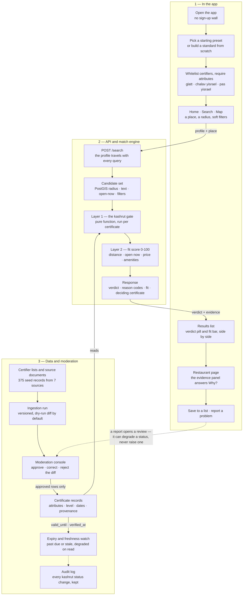
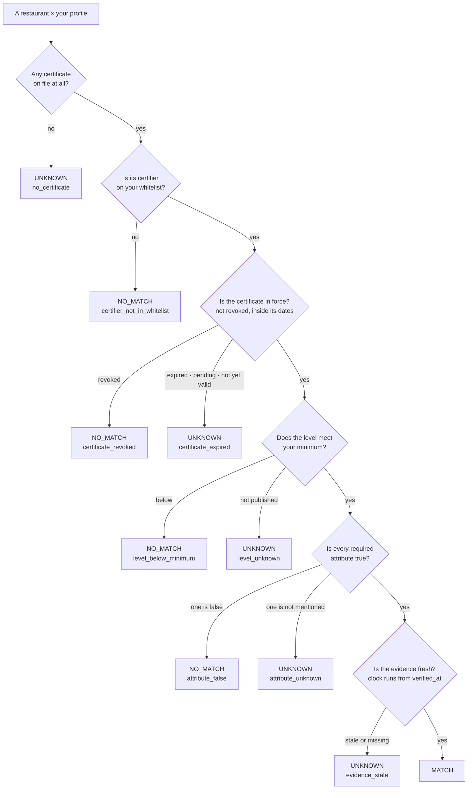
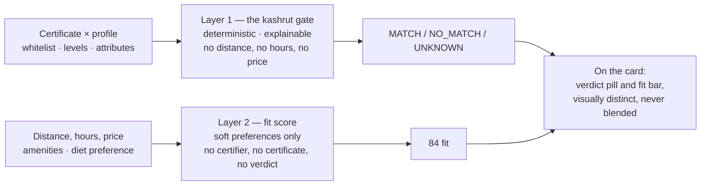

# Kashroot — app flow

One question, answered the same way every time: **can I eat here, according to my
standards?** The user defines a kashrut profile once; every restaurant then returns
one of three verdicts with the evidence attached. The app never rules on halacha.

| Verdict | Meaning |
| --- | --- |
| `MATCH` | A certificate satisfies the profile: whitelisted certifier, level met, every required attribute true, in force, evidence fresh. |
| `NO_MATCH` | The data was sufficient and it failed — a definitive published fact. |
| `UNKNOWN` | Anything else. Doubt is never resolved in the restaurant's favour. |

A rendered version of these diagrams:
<https://claude.ai/code/artifact/4d263ca7-69bb-4f85-a382-24c3db032cae>

---

## 1. End to end

Three parties. The person sets a profile and asks about a place; the backend gates and
ranks; the certificate database — built and maintained by hand — is the only thing
that can produce a `MATCH`.

**The profile is the query.** Nothing is pre-computed per user: the same restaurant
returns `MATCH` to one person and `NO_MATCH` to the next, because the gate runs
against that person's whitelist at request time.

---

## 2. Layer 1 — the kashrut gate, one certificate at a time

Five questions in a fixed order. Falling out to the left is a *definitive fact* — the
data was sufficient and it failed. Falling out to the right is *doubt*. Only a clean
run down the middle reaches `MATCH`.

**A restaurant may hold several certificates.** Each runs this gate on its own, then
the engine ranks the results — `MATCH` before `UNKNOWN` before `NO_MATCH`, then by
source authority, then by most recent verification. The winner is the *deciding
certificate* shown in the evidence panel, so the answer and its proof are always the
same document.

**Fail-safe.** Doubt goes to `UNKNOWN`; it never goes to `MATCH`. An expired
certificate with no renewal evidence degrades on read, even if the stored record still
says active. An attribute the certificate does not mention is *unknown*, not false:
absence of evidence blocks a `MATCH` but does not prove a `NO_MATCH`.

---

## 3. Two layers that never touch

Kashrut is a gate with three states. Everything else — how far, whether it's open,
price, amenities — is a soft score out of 100. Disjoint inputs; combined only in the
layout, never in arithmetic.

**The same restaurant scores 84 whether its verdict is `MATCH` or `UNKNOWN`.** Layer 2
cannot see the verdict, so a high fit score can never be misread as "mostly kosher" —
and a restaurant is never nudged past the gate by being close and open.

---

## Where each step lives

| Step | Code | Notes |
| --- | --- | --- |
| Onboarding and profile | `web/src/views/Onboarding*.tsx`, `web/src/profile/` | Profile is held client-side and sent with each query |
| Search and detail API | `app/api/public.py` | PostGIS candidate set, then per-restaurant evaluation |
| Layer 1 — the gate | `app/match/engine.py` | Pure; `now` is a parameter, not a clock |
| Layer 2 — fit score | `app/match/fit.py` | Missing soft data scores a neutral 0.5, never zero |
| Certificates and provenance | `app/models/certificate.py` | Attributes sit here, not on the certifier |
| Ingestion | `app/ingestion/seed_import.py` | Dry-run by default; writes an ingestion run plus audit rows |
| Moderation queues | `app/api/admin/`, `admin/src/views/` | Review, expiry, flags, photo evidence, audit log |

Launch gate: no city ships below 80% coverage — Tel Aviv, Jerusalem, Bnei Brak,
Haifa, Beer Sheva.
